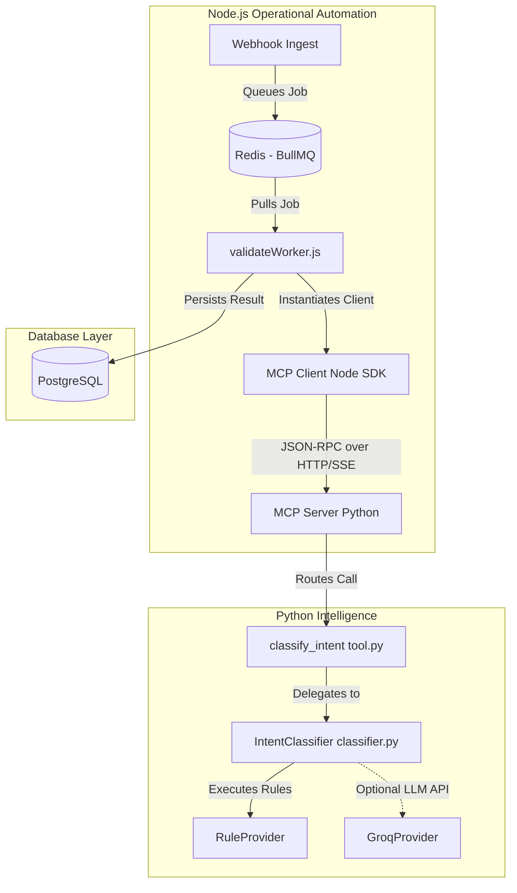

# Milestone 2: Exposing Intent Classification as an MCP Tool

Expose the existing `IntentClassificationService` (the intent classifier tool) as a Model Context Protocol (MCP) tool, enabling seamless execution from the Node.js automation layer and future ADK agent architectures.

---

## 1. Overall Architecture Diagram

The integration pattern bridges the Node.js automation layer and the Python intelligence layer using the **Model Context Protocol (MCP)** standard over **SSE (Server-Sent Events)** for production SaaS, with a local fallback using **Stdio** for development/testing.



---

## 2. New Files to Create

We will introduce a Node.js helper service to act as the MCP Client, config files for tool environments, and integration tests:

1.  **[NEW]** [src/services/mcpClient.js](file:///c:/Portofolio_projects/Candidate%20Intelligence%20and%20Revenue%20Pipeline%20Copilot/meridian-copilot/src/services/mcpClient.js)
    *   Node.js service implementing the `@modelcontextprotocol/sdk` client.
    *   Handles connections (supports both Stdio subprocess spawn for local dev/test and persistent SSE connection for production).
    *   Exposes a clean JS interface to call individual MCP tools (e.g., `classifyIntent(rawText, source, senderEmail)`).
2.  **[NEW]** [tests/test_mcp_server.py](file:///c:/Portofolio_projects/Candidate%20Intelligence%20and%20Revenue%20Pipeline%20Copilot/meridian-copilot/tests/test_mcp_server.py)
    *   Integration test suite verifying the Python MCP Server startup, tool discovery, and schema conformance.

---

## 3. Existing Files to Modify

1.  **[MODIFY]** [src/intelligence/mcp/server.py](file:///c:/Portofolio_projects/Candidate%20Intelligence%20and%20Revenue%20Pipeline%20Copilot/meridian-copilot/src/intelligence/mcp/server.py)
    *   Implement the core Python MCP server using the official Python `mcp` / `fastmcp` SDK.
    *   Expose the `classify_intent` tool.
2.  **[MODIFY]** [src/queues/workers/validateWorker.js](file:///c:/Portofolio_projects/Candidate%20Intelligence%20and%20Revenue%20Pipeline%20Copilot/meridian-copilot/src/queues/workers/validateWorker.js)
    *   Update the worker to invoke the `mcpClient.js` helper before syncing to HubSpot.
    *   Determine downstream logic based on classified intent (e.g., route applications vs. status checks vs. spam/unknown).
3.  **[MODIFY]** [package.json](file:///c:/Portofolio_projects/Candidate%20Intelligence%20and%20Revenue%20Pipeline%20Copilot/meridian-copilot/package.json)
    *   Add `@modelcontextprotocol/sdk` to dependencies.
4.  **[MODIFY]** [requirements.txt](file:///c:/Portofolio_projects/Candidate%20Intelligence%20and%20Revenue%20Pipeline%20Copilot/meridian-copilot/requirements.txt)
    *   Add `mcp` and `fastmcp` to Python dependencies.

---

## 4. Location of the MCP Server

The server will be located in the pre-allocated directory:
*   [src/intelligence/mcp/server.py](file:///c:/Portofolio_projects/Candidate%20Intelligence%20and%20Revenue%20Pipeline%20Copilot/meridian-copilot/src/intelligence/mcp/server.py)

---

## 5. Single Shared Server vs. Multiple Servers

### Decision: One Shared MCP Server
For a production SaaS architecture, we will run **one shared MCP server** hosting all Phase 2 tools, rather than isolated servers per tool.

#### Rationale:
1.  **Resource Efficiency**: Running multiple persistent Python runtimes (one per tool) increases container memory footprints and process overhead in production container environments (Docker/K8s).
2.  **Ease of Deployment**: A single server runs on a single container port (SSE transport) or as a single subprocess, simplifying proxy, routing, and networking setup.
3.  **Shared Resources**: A single server process can instantiate and share heavy connections (e.g., DB pools, Redis connections, embedding models, LLM API client rate-limiters) across all tools.
4.  **Protocol Alignment**: The MCP specification natively supports exposing multiple tools from a single server. Client agents query tool lists and call tools by name dynamically.

---

## 6. Registering `classify_intent` as an MCP Tool

We will utilize `FastMCP` from the official Python `mcp` SDK to register the tool cleanly:

```python
from fastmcp import FastMCP
from src.intelligence.tools.intent_classifier.schema import IntentInput
from src.intelligence.tools.intent_classifier.tool import classify_intent

mcp = FastMCP("Meridian Intelligence Server")

@mcp.tool(
    name="classify_intent",
    description="Classify candidate outreach emails, forms, and uploads into categorized intents."
)
async def classify_intent_tool(raw_text: str, source: str, sender_email: str) -> str:
    # Wrap primitive parameters into Pydantic schema
    input_data = IntentInput(
        raw_text=raw_text,
        source=source,
        sender_email=sender_email
    )
    # Execute the underlying classifier service
    result = await classify_intent(input_data)
    # Return formatted JSON string matching IntentOutput schema
    return result.model_dump_json()
```

---

## 7. Reusing Business Logic Without Duplication

The core classifier code under `src/intelligence/tools/intent_classifier/` remains strictly decoupled from the MCP transport mechanism:
*   `schema.py`, `rules.py`, `classifier.py`, and `tool.py` contain all classification, schema, validation, and business rules.
*   The MCP Server acts purely as a **transport adapter layer**. It imports the business logic from `tool.py` and delegates the classification work, serving only to map incoming MCP JSON-RPC parameters to the inner `IntentInput` Pydantic models.

---

## 8. Node.js Worker Integration

The Node.js worker will interact with the Python MCP layer via a dedicated client service helper `mcpClient.js`:

```javascript
// src/queues/workers/validateWorker.js
import { mcpClient } from "../../services/mcpClient.js";

const worker = new Worker("candidateQueue", async (job) => {
  const payload = job.data.payload;
  
  // Call the MCP tool
  const classificationJson = await mcpClient.callTool("classify_intent", {
    raw_text: payload.text || payload.message || "",
    source: "form",
    sender_email: payload.email
  });
  
  const classification = JSON.parse(classificationJson);
  
  // Route downstream actions based on intent
  if (classification.intent === "spam") {
    // Flag or ignore
    return;
  }
  
  // Proceed with HubSpot / Slack syncs
  ...
}, { connection });
```

In production, the `mcpClient` will connect via **SSE** to a persistent Python container. For local test environments, the client can fall back to **Stdio** by spawning the Python process (`py src/intelligence/mcp/server.py`) and communicating over standard I/O streams.

---

## 9. Scaling to Remaining Phase 2 Tools

The design supports scaling seamlessly to the remaining intelligence services:
1.  **Modular Tool Creation**: Create subdirectories in `src/intelligence/tools/` for each tool (e.g., `candidate_classifier`, `enricher`, `rag_retriever`, `qualification_scorer`, `summarizer`).
2.  **Decoupled Services**: Each folder defines its own schemas, providers, prompt files, and entry point functions.
3.  **Unified Registration**: Register each tool in [server.py](file:///c:/Portofolio_projects/Candidate%20Intelligence%20and%20Revenue%20Pipeline%20Copilot/meridian-copilot/src/intelligence/mcp/server.py) by importing its main function and decorating it with `@mcp.tool()`.
4.  **Universal Client**: The Node.js worker can utilize the single client connection to invoke any registered tool dynamically:
    ```javascript
    const enrichment = await mcpClient.callTool("enrich_candidate", { ... });
    ```

---

## 10. Alignment with Google ADK Sourcing Agent

The Google Agent Development Kit (ADK) relies on well-defined tool interfaces to build autonomous multi-agent pipelines:
*   By adopting **MCP**, the tools self-document. Every tool decorated via `@mcp.tool()` exposes its JSON Schema parameters and text descriptions natively.
*   The ADK Meridian Sourcing Agent can connect directly to the shared MCP server, automatically inspect the available tool schemas, and execute reasoning loops calling `classify_intent`, `enrich_candidate`, or `retrieve_rag_context` dynamically.

---

## 11. Testing Strategy for the MCP Layer

We will split testing into three distinct validation scopes:

1.  **Core Business Logic Tests**:
    *   Executed via standard unit tests (e.g., [tests/test_intent_rules.py](file:///c:/Portofolio_projects/Candidate%20Intelligence%20and%20Revenue%20Pipeline%20Copilot/meridian-copilot/tests/test_intent_rules.py)).
    *   Validates keyword rules, classifications, and confidence calculations in isolation.
2.  **MCP Protocol Integration Tests** (`tests/test_mcp_server.py`):
    *   Loads the MCP Python server in a local client test harness.
    *   Asserts tool registry completeness (`classify_intent` listed).
    *   Verifies that calling the tool via MCP returns valid serialized `IntentOutput` data.
3.  **End-to-End Node.js Integration Tests**:
    *   Test case triggering the BullMQ worker and asserting that the worker successfully invokes the MCP client wrapper, receives classifications, and routes data accordingly.
