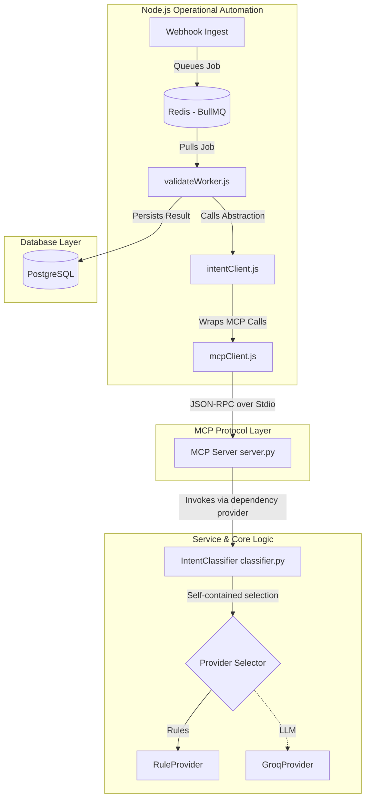

# Milestone 2: Exposing Intent Classification as an MCP Tool

Expose the existing `IntentClassificationService` (orchestrated by the `IntentClassifier` class) as a Model Context Protocol (MCP) tool, using clean service instantiation, enriched structured logging, and local `stdio` transport.

---

## 1. Overall Architecture Diagram



---

## 2. New Files to Create

1.  **[NEW]** [src/services/mcpClient.js](file:///c:/Portofolio_projects/Candidate%20Intelligence%20and%20Revenue%20Pipeline%20Copilot/meridian-copilot/src/services/mcpClient.js)
    *   Low-level client wrapper for the `@modelcontextprotocol/sdk`.
    *   Handles subprocess spawning of the Python MCP server via **stdio**.
2.  **[NEW]** [src/services/intentClient.js](file:///c:/Portofolio_projects/Candidate%20Intelligence%20and%20Revenue%20Pipeline%20Copilot/meridian-copilot/src/services/intentClient.js)
    *   High-level JS client wrapper routing candidate intents. Exposes `classifyCandidateIntent()`, hiding MCP tool name constraints.
3.  **[NEW]** [tests/test_mcp_server.py](file:///c:/Portofolio_projects/Candidate%20Intelligence%20and%20Revenue%20Pipeline%20Copilot/meridian-copilot/tests/test_mcp_server.py)
    *   Integration test suite to verify Python MCP server startup, tool schema, and structured logs.

---

## 3. Existing Files to Modify

1.  **[MODIFY]** [src/intelligence/mcp/server.py](file:///c:/Portofolio_projects/Candidate%20Intelligence%20and%20Revenue%20Pipeline%20Copilot/meridian-copilot/src/intelligence/mcp/server.py)
    *   Implement Python MCP server over local `stdio` transport.
    *   Register the `classify_intent` tool.
    *   Log detailed JSON objects for each invocation.
2.  **[MODIFY]** [src/queues/workers/validateWorker.js](file:///c:/Portofolio_projects/Candidate%20Intelligence%20and%20Revenue%20Pipeline%20Copilot/meridian-copilot/src/queues/workers/validateWorker.js)
    *   Integrate `intentClient.js` helper.
3.  **[MODIFY]** [package.json](file:///c:/Portofolio_projects/Candidate%20Intelligence%20and%20Revenue%20Pipeline%20Copilot/meridian-copilot/package.json)
    *   Add `@modelcontextprotocol/sdk` to dependencies.
4.  **[MODIFY]** [requirements.txt](file:///c:/Portofolio_projects/Candidate%20Intelligence%20and%20Revenue%20Pipeline%20Copilot/meridian-copilot/requirements.txt)
    *   Add `mcp` and `fastmcp` to Python dependencies.

---

## 4. Architectural Constraint Alignments

### I. Unversioned Tool Name
Tools are registered under clean names (`classify_intent`). Versioning is managed at the server/API layer via standard MCP server info/metadata (e.g. name = `"Meridian Intelligence Server"`, version = `"1.0.0"`). New tool names are only introduced if incompatible contract changes arise.

### II. Dependency Injection for Classifiers
Avoid global classifier instances in the adapter. Instead, instantiate via a helper provider:
```python
def get_classifier() -> IntentClassifier:
    return IntentClassifier()
```
This allows tests to mock/inject configurations, swap underlying models, and benchmark providers easily.

### III. Enriched Structured Logging
Every MCP tool execution logs a JSON object containing:
*   `request_id` (unique per tool call, generated or passed)
*   `event_id` (link back to parent events/logs)
*   `provider` (rules, groq, etc.)
*   `fallback_used` (boolean)
*   `confidence` (float)
*   `duration_ms` (latency tracking)
*   `tool` (called tool name)

### IV. Postponed SSE Integration
For simplicity and ease of testing, Milestone 2 will strictly employ **stdio** transport for local process communication. Node.js client subprocesses will communicate with the Python MCP server over standard input/output streams.
