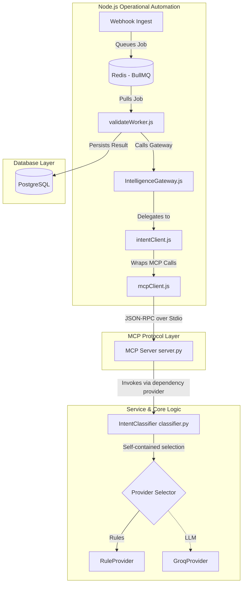

# Milestone 2: Exposing Intent Classification as an MCP Tool

Expose the existing `IntentClassificationService` (orchestrated by the `IntentClassifier` class) as a Model Context Protocol (MCP) tool, using clean service instantiation, enriched structured logging, local `stdio` transport, and configurable Node-side clients.

---

## 1. Overall Architecture Diagram



---

## 2. New Files to Create

1.  **[NEW]** [src/services/mcpClient.js](file:///c:/Portofolio_projects/Candidate%20Intelligence%20and%20Revenue%20Pipeline%20Copilot/meridian-copilot/src/services/mcpClient.js)
    *   Low-level client wrapper for `@modelcontextprotocol/sdk`.
    *   Launches the Python subprocess using `process.env.PYTHON_PATH` or a default fallback.
    *   Handles connection lifecycle, input/output serialization, and timeout configuration.
2.  **[NEW]** [src/services/intentClient.js](file:///c:/Portofolio_projects/Candidate%20Intelligence%20and%20Revenue%20Pipeline%20Copilot/meridian-copilot/src/services/intentClient.js)
    *   Domain client wrapper that converts JS arguments to MCP parameters, calls `mcpClient.callTool`, and parses `IntentOutput`.
3.  **[NEW]** [src/services/intelligenceGateway.js](file:///c:/Portofolio_projects/Candidate%20Intelligence%20and%20Revenue%20Pipeline%20Copilot/meridian-copilot/src/services/intelligenceGateway.js)
    *   A unified facade (Gateway pattern) aggregating all individual intelligence services.
    *   Provides a single entry point for workers and future ADK agent interfaces, facilitating telemetry, trace propagation, and connection pooling.
4.  **[NEW]** [tests/test_mcp_server.py](file:///c:/Portofolio_projects/Candidate%20Intelligence%20and%20Revenue%20Pipeline%20Copilot/meridian-copilot/tests/test_mcp_server.py)
    *   Integration test suite to verify Python MCP server startup, tool schema, and structured logs.

---

## 3. Existing Files to Modify

1.  **[MODIFY]** [src/intelligence/mcp/server.py](file:///c:/Portofolio_projects/Candidate%20Intelligence%20and%20Revenue%20Pipeline%20Copilot/meridian-copilot/src/intelligence/mcp/server.py)
    *   Implement Python MCP server over local `stdio` transport.
    *   Extend `classify_intent` tool signature to accept an optional `context` dictionary parameter containing `event_id`, `job_id`, `request_id`, and `trace_id`.
    *   Log detailed JSON objects to `sys.stderr` correlating the trace IDs.
2.  **[MODIFY]** [src/queues/workers/validateWorker.js](file:///c:/Portofolio_projects/Candidate%20Intelligence%20and%20Revenue%20Pipeline%20Copilot/meridian-copilot/src/queues/workers/validateWorker.js)
    *   Import and call `intelligenceGateway` to execute intent classification, passing the BullMQ job identifiers as tracing context.
3.  **[MODIFY]** [package.json](file:///c:/Portofolio_projects/Candidate%20Intelligence%20and%20Revenue%20Pipeline%20Copilot/meridian-copilot/package.json)
    *   Add `@modelcontextprotocol/sdk` to dependencies.
4.  **[MODIFY]** [requirements.txt](file:///c:/Portofolio_projects/Candidate%20Intelligence%20and%20Revenue%20Pipeline%20Copilot/meridian-copilot/requirements.txt)
    *   Add `mcp` and `fastmcp` to Python dependencies.

---

## 4. Architectural Integration Details

### I. Executable and Process Configuration
The `mcpClient.js` launches the Python MCP server subprocess based on configurable environment variables:
```javascript
const pythonPath = process.env.PYTHON_PATH || 'python';
const mcpServerModule = 'src.intelligence.mcp.server';
const subprocess = spawn(pythonPath, ['-m', mcpServerModule], { stdio: ['pipe', 'pipe', 'pipe'] });
```

### II. Request Timeouts
To prevent thread starvation or endless hangs in case of downstream latency, `mcpClient.js` configures tool calls with a configurable timeout (defaulting to `10000ms`, loaded via `process.env.MCP_REQUEST_TIMEOUT_MS`):
*   If the timeout triggers before stdout returns the JSON-RPC response, the pending promise is rejected with a `TimeoutError`.

### III. Execution Context Tracing
To link the Node.js automation workflow and the Python intelligence layer, we pass a structured context map:
```javascript
const context = {
  event_id: `evt_${uuid()}`,
  job_id: job.id,
  trace_id: job.id // Correlated to the logging trace_id
};
```
This context object is sent as an argument in the tool call:
```javascript
mcpClient.callTool("classify_intent", { raw_text, source, sender_email, context });
```
On the Python side, `server.py` extracts the IDs from the `context` argument to emit correlated JSON logs to `stderr`, enabling unified tracing across both microservice boundaries.

### IV. Failure Isolation & Subprocess Recovery
*   **Transport Failures**: If standard streams throw an `EPIPE` error, close unexpectedly, or the process terminates (exits with a non-zero code), the client detects a transport-level failure and restarts the Python subprocess.
*   **Application/Business Failures**: If the subprocess runs successfully but returns a JSON-RPC error result (e.g. a Pydantic `ValidationError` or core python exception caught in the handler), the `mcpClient.js` propagates the error immediately to `intentClient` **without restarting the subprocess**, avoiding unnecessary boot overhead.

### V. Simplification of Future ADK Agent via IntelligenceGateway
Introducing the `IntelligenceGateway` abstraction provides a unified endpoint facade for all AI actions. This significantly simplifies integration for the Google ADK Meridian Sourcing Agent:
1.  **Unified Entry Point**: The ADK agent executes operations through a single interface, eliminating imports and configuration for multiple clients.
2.  **Telemetry & Tracing**: Gateway intercepts calls to automatically inject unified tracing (`event_id`, `trace_id`) and track latency across all tool invocations.
3.  **Transport Independence**: If we migrate from local `stdio` processes to a centralized SSE/HTTP server in production, only the Gateway/MCP Client boundary is altered; the rest of the application remains unchanged.
4.  **Composition Pattern**: Complex multi-agent workflows (e.g. classify outreach -> if application, enrich candidate -> if matched, score qualification) can be composed within the gateway, shielding the agent from pipeline orchestrations.
