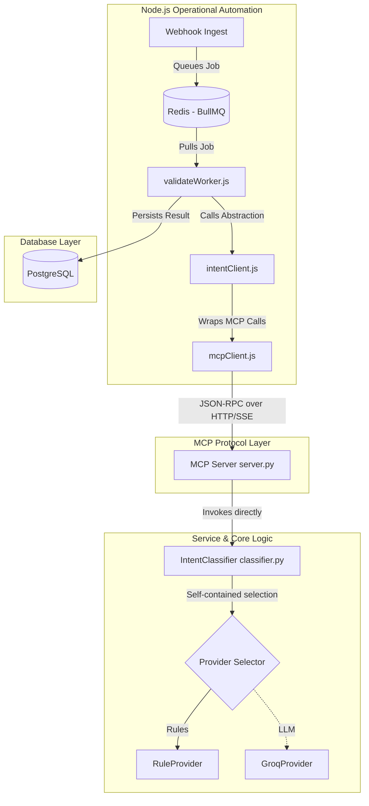

# Milestone 2: Exposing Intent Classification as an MCP Tool

Expose the existing `IntentClassificationService` (orchestrated by the `IntentClassifier` class) as a Model Context Protocol (MCP) tool, while maintaining strict architectural boundaries.

---

## 1. Overall Architecture Diagram

The revised design enforces clear boundaries:
*   **Transport Adapter**: The Python MCP server maps the protocol layer directly to the core service.
*   **Encapsulation**: Provider routing is sealed inside the Python service.
*   **Abstraction**: The Node.js worker talks to a dedicated `intentClient` service, keeping BullMQ completely unaware of MCP tool names.



---

## 2. New Files to Create

1.  **[NEW]** [src/services/mcpClient.js](file:///c:/Portofolio_projects/Candidate%20Intelligence%20and%20Revenue%20Pipeline%20Copilot/meridian-copilot/src/services/mcpClient.js)
    *   Low-level client wrapper for the `@modelcontextprotocol/sdk`.
    *   Handles connection lifecycle (SSE for production, Stdio subprocess spawning for local dev/testing).
2.  **[NEW]** [src/services/intentClient.js](file:///c:/Portofolio_projects/Candidate%20Intelligence%20and%20Revenue%20Pipeline%20Copilot/meridian-copilot/src/services/intentClient.js)
    *   High-level domain abstraction for the Node.js application.
    *   Exposes clean JavaScript functions (e.g., `classifyCandidateIntent(rawText, source, senderEmail)`) mapping directly to business workflows.
    *   Hides all MCP tool naming conventions and payload layouts from Node workers.
3.  **[NEW]** [tests/test_mcp_server.py](file:///c:/Portofolio_projects/Candidate%20Intelligence%20and%20Revenue%20Pipeline%20Copilot/meridian-copilot/tests/test_mcp_server.py)
    *   Integration test suite to verify the Python MCP server registry, structured logs, and version routing.

---

## 3. Existing Files to Modify

1.  **[MODIFY]** [src/intelligence/mcp/server.py](file:///c:/Portofolio_projects/Candidate%20Intelligence%20and%20Revenue%20Pipeline%20Copilot/meridian-copilot/src/intelligence/mcp/server.py)
    *   Implement the Python MCP server using the official Python `mcp` / `fastmcp` SDK.
    *   Define structured JSON logging for all incoming requests, processing times, and outputs.
    *   Expose versioned tools (`classify_intent_v1`).
2.  **[MODIFY]** [src/queues/workers/validateWorker.js](file:///c:/Portofolio_projects/Candidate%20Intelligence%20and%20Revenue%20Pipeline%20Copilot/meridian-copilot/src/queues/workers/validateWorker.js)
    *   Import and call the `intentClient.js` helper instead of executing raw MCP calls.
3.  **[MODIFY]** [package.json](file:///c:/Portofolio_projects/Candidate%20Intelligence%20and%20Revenue%20Pipeline%20Copilot/meridian-copilot/package.json)
    *   Add `@modelcontextprotocol/sdk` to dependencies.
4.  **[MODIFY]** [requirements.txt](file:///c:/Portofolio_projects/Candidate%20Intelligence%20and%20Revenue%20Pipeline%20Copilot/meridian-copilot/requirements.txt)
    *   Add `mcp` and `fastmcp` to Python dependencies.

---

## 4. Architectural Constraint Alignments

### I. Direct Service Invocation
The MCP Server will bypass the `tool.py` wrapper and invoke `IntentClassifier` (the core classification service class) directly:
```python
from src.intelligence.tools.intent_classifier.classifier import IntentClassifier
classifier_service = IntentClassifier()
```

### II. IntentClient Abstraction in Node.js
To decouple our workers from transport mechanics, workers will not interact with MCP APIs directly:
*   **Worker**: calls `intentClient.classifyCandidateIntent(text, source, email)`.
*   **Intent Client**: converts JS arguments to MCP-formatted parameters, invokes `mcpClient.callTool("classify_intent_v1", params)`, parses the returned JSON string, and returns a normalized JavaScript object.

### III. MCP Server as a Pure Transport Adapter
The Python MCP server file will contain **zero business logic**. Its responsibilities are strictly:
1.  Defining the transport channel (Stdio / SSE).
2.  Declaring tool schemas and interface definitions.
3.  Deserializing incoming JSON payloads and validating parameters using Pydantic.
4.  Delegating execution immediately to the core Python service (`IntentClassifier`).
5.  Formatting exceptions and serializing results back to the client.

### IV. Provider Selection Encapsulation
The provider selection logic (deciding whether to execute rule-based matching via `RuleProvider` or dynamic LLM inference via `GroqProvider`) remains entirely inside `IntentClassifier.classify()`. The MCP server is completely blind to how the classification is computed.

### V. Structured Logging
Every MCP tool execution will emit formatted JSON logs containing:
*   `timestamp`
*   `tool_name` (including version)
*   `execution_duration_ms`
*   `request_metadata` (e.g. sender email domain, source type)
*   `status` (success / failure)
*   `error` (if applicable)

```json
{"timestamp": "2026-07-13T02:05:00Z", "tool": "classify_intent_v1", "duration_ms": 12.4, "status": "success", "sender_domain": "example.com"}
```

### VI. Tool Versioning Strategy
To support future changes without breaking running services, the MCP server will use **explicit tool naming version suffixes**:
*   The first release is registered as `classify_intent_v1`.
*   If we alter parameters or outputs in the future, we can register `classify_intent_v2` in the same server.
*   The Node.js `intentClient` handles mapping to the appropriate active version, shielding the worker code from version migration churn.

---

## 5. Unified Server Registry

We will run a **single shared MCP server** in [server.py](file:///c:/Portofolio_projects/Candidate%20Intelligence%20and%20Revenue%20Pipeline%20Copilot/meridian-copilot/src/intelligence/mcp/server.py). As we add tools, they will be registered side-by-side with version numbers:

```python
@mcp.tool(name="classify_intent_v1")
async def classify_intent_v1(raw_text: str, source: str, sender_email: str) -> str:
    # Structured log request
    ...
    res = classifier_service.classify(raw_text)
    # Structured log response
    return res.model_dump_json()

@mcp.tool(name="enrich_candidate_v1")
async def enrich_candidate_v1(email: str) -> str:
    ...
```

---

## 6. Testing Strategy

1.  **Unit Tests**: Run Python unit tests focusing strictly on the `IntentClassifier` class and its provider strategies.
2.  **Server Integration Tests** (`tests/test_mcp_server.py`): Run tests that boot the server locally via Stdio transport and call `classify_intent_v1` using an MCP mock client, asserting correct outputs and structured log emissions.
3.  **Worker Integration Tests**: Validate that Node.js queue workers succeed when calling `intentClient.classifyCandidateIntent()`.
