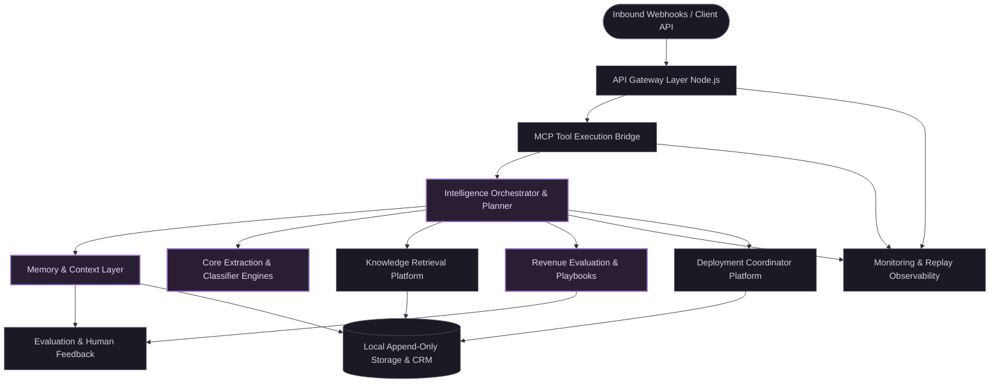
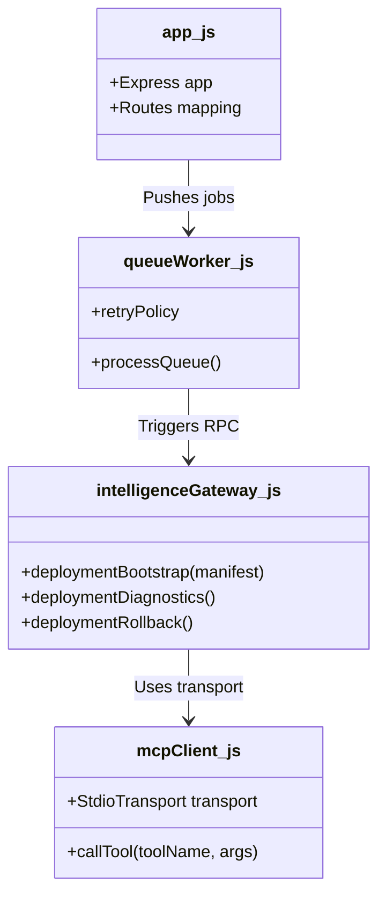
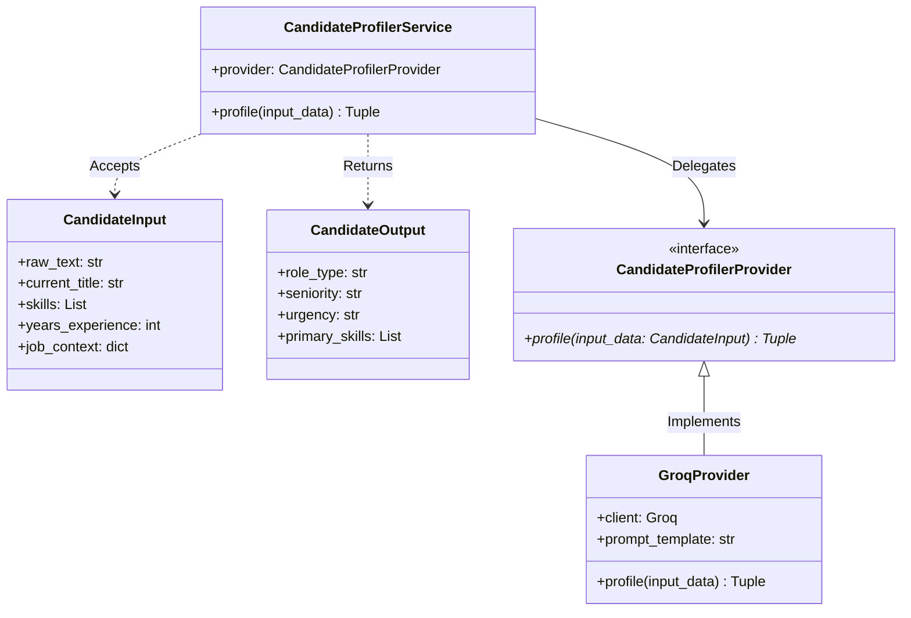
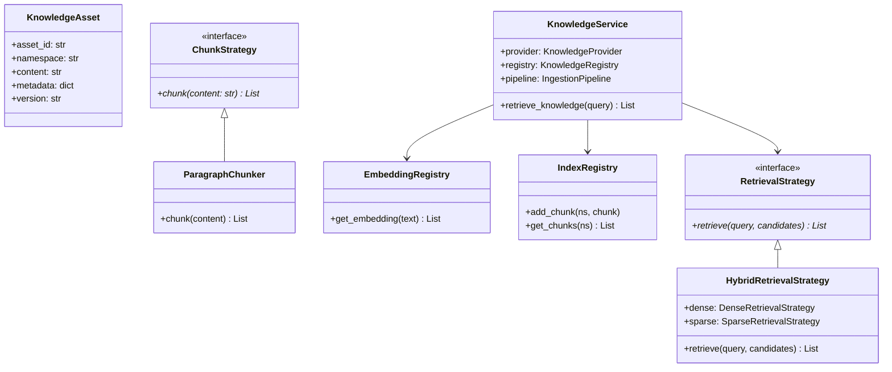
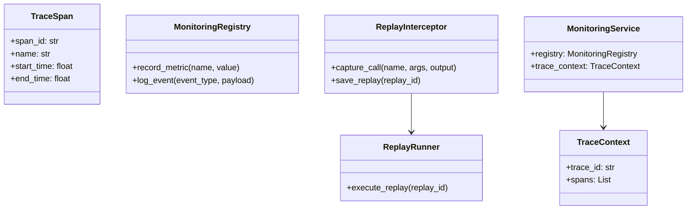
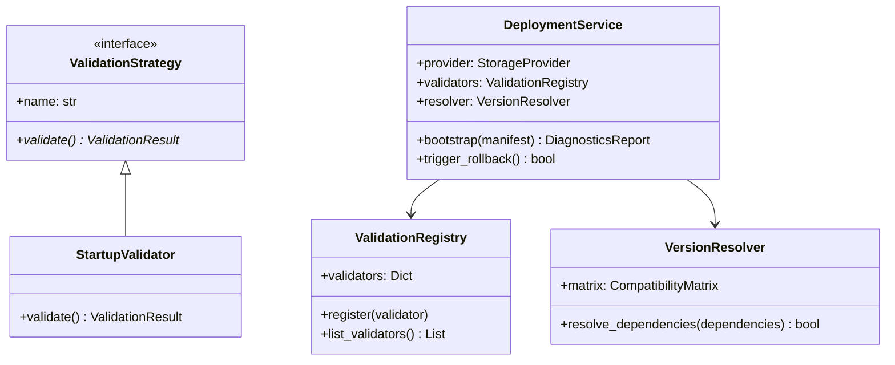
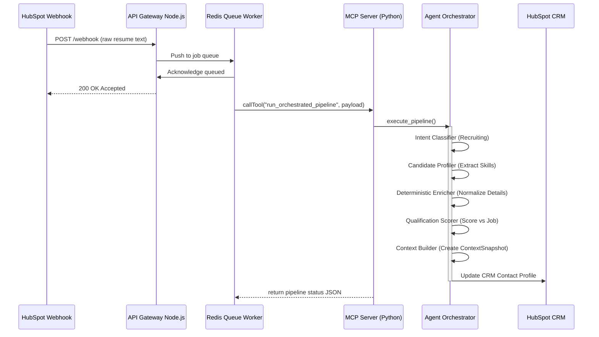

# Meridian Platform v1.0 Architecture Snapshot

This document provides a comprehensive, multi-layered architectural snapshot of the **Meridian Platform v1.0** (Milestones 1–20). Its purpose is to capture the repository's current structure, boundaries, patterns, and assumptions before building the first external product on top of the platform.

---

## Table of Contents
1. [LEVEL 0 — One-Screen Executive Architecture](#level-0--one-screen-executive-architecture)
2. [LEVEL 1 — Major Subsystems](#level-1--major-subsystems)
3. [LEVEL 2 — Component Architecture](#level-2--component-architecture)
4. [LEVEL 3 — Important Execution Flows](#level-3--important-execution-flows)
5. [Architectural Decision Analysis](#architectural-decision-analysis)
6. [Platform vs Product Boundary](#platform-vs-product-boundary)
7. [Domain-Agnostic Analysis](#domain-agnostic-analysis)
8. [Multimodal Architecture Reality Check](#multimodal-architecture-reality-check)
9. [Reusability Analysis](#reusability-analysis)
10. [First-Product Validation Hypotheses](#first-product-validation-hypotheses)
11. [Architecture Evolution Boundary](#architecture-evolution-boundary)
12. [Architecture Snapshot Summary](#architecture-snapshot-summary)

---

## LEVEL 0 — One-Screen Executive Architecture

The following block diagram represents the complete Meridian v1.0 platform top-level boundary layout, capturing the transition from ingestion to orchestration and infrastructure.



### High-Level Block Explanations
*   **API Gateway Layer (Node.js)**: Acts as the entry gate for all incoming requests (e.g. webhooks, API prompts). It validates JSON payloads, routes traffic, manages queues, and handles external integrations.
*   **MCP Tool Execution Bridge**: Coordinates communication between Node.js services and Python execution workers using the Model Context Protocol (MCP). It translates Javascript calls into standardized MCP tool calls.
*   **Intelligence Orchestrator & Planner**: The logical "brain." The Planner builds structured execution paths (graphs of actions), and the Agent Orchestrator runs them step-by-step, validating preconditions and running fallback rules when errors occur.
*   **Core Extraction & Classifier Engines**: Specialized stateless workers (using rule-based logic or LLM clients) that classify input intent (e.g., job application vs. general inquiry) and extract candidate/client attributes from raw text.
*   **Memory & Context Layer**: Aggregates data from different tools into unified snapshots. It maintains session histories (short-term sliding windows) and appends sessions to a long-term file store.
*   **Knowledge Retrieval Platform**: A searchable store for structural domain knowledge. It ingests files, splits them into logical chunks, calculates vector embeddings, and performs hybrid search (dense semantic search + keyword search).
*   **Revenue Evaluation & Playbooks**: Implements business-specific calculations (e.g., qualifying resumes against job descriptions, identifying revenue opportunities, selecting playbooks, and drafting emails).
*   **Evaluation & Human Feedback**: Standardizes testing and auditing. The Evaluation Framework runs batch scorecards, and the Human Feedback Platform collects analyst reviews and promotes verified samples to benchmark datasets.
*   **Monitoring & Replay Observability**: Records performance metrics (e.g. LLM latency, token counts), writes logs, manages tracing spans, alerts operators to failures, and replays historic requests for debugging.
*   **Deployment Coordinator Platform**: Orchestrates workspace startup checks, verifies python dependency bounds, registers capabilities, upgrades configurations, and handles rollback commands.
*   **Local Append-Only Storage & CRM**: Filesystem-based database files (`.jsonl`) and external CRMs (HubSpot) that store application states, audit logs, and memories.

---

## LEVEL 1 — Major Subsystems

This section breaks down each Level-0 block into its structural boundaries, dependencies, and communication patterns.

```mermaid
graph TB
    subgraph Ingestion & Communication
        Webhooks[Webhooks / Express Server] --> Worker[Queue Workers]
        Worker --> CRM[HubSpot / Slack Integration]
        Worker --> MCPClient[MCP JS Client]
    end

    subgraph MCP Server
        MCPClient -- stdio transport --► MCPServer[FastMCP Python Server]
    end

    subgraph Orchestration Core
        MCPServer --> Orchestrator[Agent Orchestrator]
        Orchestrator --> Planner[Rule-Based Planner]
    end

    subgraph Context & Memory
        Orchestrator --> ContextBld[Context Builder]
        Orchestrator --> SessionMem[Sliding Conversation Memory]
        Orchestrator --> LongTermMem[Append-Only Memory Store]
    end

    subgraph Intelligence Engines
        Orchestrator --> Intent[Intent Classifier]
        Orchestrator --> Profiler[Candidate Profiler]
        Orchestrator --> Enricher[Deterministic Enricher]
        Orchestrator --> Scorer[Qualification Scorer]
        Orchestrator --> Summarizer[Summarizer]
    end

    subgraph Knowledge Infrastructure
        Orchestrator --> Chunking[Chunking & Ingestion Pipeline]
        Orchestrator --> VectorSearch[Hybrid Retrieval Strategy]
    end

    subgraph Assessment & Actions
        Orchestrator --> OppIntel[Opportunity Intelligence]
        Orchestrator --> Copilot[Revenue Copilot Playbooks]
    end

    subgraph Quality & Observability
        Orchestrator & ContextBld --> Eval[Batch Evaluation Framework]
        Orchestrator --> Feedback[Feedback & Promotion Pipeline]
        Orchestrator --> Replay[Replay & Debug Interceptor]
        Orchestrator --> Telemetry[Observability Monitoring Service]
    end

    subgraph System Lifecycle
        MCPServer --> Deployment[Deployment Coordinator]
    end
```

### 1. Ingestion & Communication Subsystem
*   **Problem Solved**: Manages HTTP ingestion traffic, rate limits incoming requests, serializes external CRM webhooks, queues jobs to prevent server overload, and maintains client connectivity.
*   **What it Owns**: Express routes, HubSpot/Slack integration scripts, queue worker files (`src/workers/queueWorker.js`), and the Node.js `mcpClient.js`.
*   **What it does NOT own**: Core LLM prompts, similarity search indexes, or database files.
*   **What it depends on**: Redis/in-memory queue queues, Node.js runtime, and the MCP Python Server.
*   **What depends on it**: External webhook providers (HubSpot).
*   **Boundary Rationale**: Keeps HTTP parsing, routing, and networking isolated from CPU-heavy AI reasoning tasks.

### 2. MCP Server Bridge
*   **Problem Solved**: Provides a clean, typed bridge between Node.js services and Python-based LLM orchestration workflows.
*   **What it Owns**: `src/intelligence/mcp/server.py` and FastMCP execution schemas.
*   **What it does NOT own**: Component business logic or telemetry logging directories.
*   **What it depends on**: Python FastMCP runtime and individual tool packages.
*   **What depends on it**: The Node.js API gateway client.
*   **Boundary Rationale**: Acts as an RPC protocol interface, allowing developers to change the client language without altering core Python tool logic.

### 3. Orchestration & Planning
*   **Problem Solved**: Solves the problem of mapping complex user goals to sequences of tool executions, handling execution dependency trees, and recovering from failures.
*   **What it Owns**: `src/intelligence/tools/planner` and `src/intelligence/tools/agent_orchestrator`.
*   **What it does NOT own**: Component implementations or state persistence files.
*   **What it depends on**: Core intelligence tool registration records.
*   **What depends on it**: MCP tool endpoints.
*   **Boundary Rationale**: Decouples "deciding what to do" (planning) from "actually executing" (actions).

### 4. Context & Memory Subsystem
*   **Problem Solved**: Gathers outputs from multiple independent tools into an immutable snapshot, and maintains session-level conversation history.
*   **What it Owns**: `context_builder`, `memory_service` (long-term database logs), and `conversation_memory` (sliding window memory).
*   **What it does NOT own**: Vector indexing structures or raw LLM completions.
*   **What it depends on**: JSONL storage engines.
*   **What depends on it**: Agent Orchestrator, Opportunity Intelligence.
*   **Boundary Rationale**: Ensures that context snapshotting and short-term conversation states are managed separately from unstructured text retrieval.

### 5. Core Intelligence Engines
*   **Problem Solved**: Extracts structured data (resumes, emails, company names) from raw, unstructured text.
*   **What it Owns**: `intent_classifier`, `candidate_profiler`, `deterministic_enricher`, and `summarizer`.
*   **What it does NOT own**: Prompt aggregation or evaluation scores.
*   **What it depends on**: LLM Clients (Groq, OpenAI) and regex-based normalization modules.
*   **What depends on it**: Context Builder, Qualification Scorer.
*   **Boundary Rationale**: Keeps data normalization and extraction stateless, making these engines highly reusable.

### 6. Knowledge Infrastructure
*   **Problem Solved**: Manages structured document chunking, indexing, and retrieval across namespaces.
*   **What it Owns**: Chunking strategies (`ChunkStrategy`), embedding engines, search filters, and index registries.
*   **What it does NOT own**: Long-term conversational history.
*   **What it depends on**: Filesystem JSONL stores.
*   **What depends on it**: Qualification Scorer, Agent Orchestrator.
*   **Boundary Rationale**: Encapsulates document indexing and semantic retrieval strategies under a unified interface.

### 7. Assessment & Action Playbooks
*   **Problem Solved**: Evaluates qualified candidates, categorizes business opportunities, and drafts outreach communications.
*   **What it Owns**: `opportunity_intelligence`, `revenue_copilot` playbooks, and communications generators.
*   **What it does NOT own**: Input profile data.
*   **What it depends on**: Context snapshots and conversation memory.
*   **What depends on it**: Orchestrator, E2E gateway endpoints.
*   **Boundary Rationale**: Keeps domain-specific business rules (playbooks) isolated from core platform infrastructure.

### 8. Quality & Observability Subsystem
*   **Problem Solved**: Captures telemetry logs, manages transaction spans, replays historic sessions, runs evaluations, and records analyst feedback.
*   **What it Owns**: `monitoring_observability` service, `replay_debug` interceptor, `evaluation_framework`, and `human_feedback` registries.
*   **What it does NOT own**: Deployment state management.
*   **What it depends on**: Storage engines.
*   **What depends on it**: All platform components (via telemetry decorators and hooks).
*   **Boundary Rationale**: Standardizes operational logging and quality verification across the platform.

### 9. System Lifecycle & Deployment Coordinator
*   **Problem Solved**: Coordinates platform bootstrapping, verifies versions, registers capabilities, and manages rollbacks without relying on cloud-specific scripts.
*   **What it Owns**: `deployment` service, `ValidationRegistry`, and lifecycle events.
*   **What it does NOT own**: Docker, Kubernetes, or cloud-specific deployment files.
*   **What it depends on**: Telemetry endpoints.
*   **What depends on it**: MCP startup hooks.
*   **Boundary Rationale**: Keeps platform deployment logic generic and infrastructure-agnostic.

---

## LEVEL 2 — Component Architecture

This level details the internal patterns (schemas, strategies, registries, providers) used across the subsystems.

### 1. Ingestion, Queue, and Gateway Components
The Express server ingests payloads, writes to an in-memory queue, and uses the `mcpClient` to communicate with the python backend.



### 2. The Core Intelligence Component (Candidate Profiler)
LLM interactions use the **Schema → Strategy → Provider → Service** pattern:



### 3. Production Knowledge Platform Component
Shows the relationship between chunkers, indexers, embedding registries, and retrieval strategies.



### 4. Observability and Replay Components
Observability uses decorators, tracing context managers, and logging providers to track performance and support replays.



### 5. Deployment Coordinating Component
Manages platform bootstrapping, dependency checking, and capability registration.



---

## LEVEL 3 — Important Execution Flows

This section traces the path data takes through the system for key operations.

### 1. E2E Ingestion & Orchestration Flow

```
[Inbound Raw Text Webhook]
       │
       ▼
Express API Router (src/app.js)
       │
       ▼
Queue Worker (src/workers/queueWorker.js)
       │
       ▼
MCP Client (src/services/mcpClient.js)
       │
       ▼
MCP Server stdio (src/intelligence/mcp/server.py)
       │
       ▼
Agent Orchestrator Service (src/intelligence/tools/agent_orchestrator/service.py)
       │
       ▼
Runs Steps Sequentially (Classifier -> Profiler -> Enricher -> Scorer -> ContextBuilder)
       │
       ▼
Writes to HubSpot CRM & appends to Session JSONL
       │
       ▼
Express API responds with 200 SUCCESS
```



### 2. Knowledge Ingestion & Retrieval Flow

```
[Knowledge Ingestion (JSON/MD Document)]
       │
       ▼
FastMCP Server tool (ingest_knowledge)
       │
       ▼
KnowledgeService Ingest (src/intelligence/tools/knowledge_platform/service.py)
       │
       ▼
Split into chunks via ParagraphChunker (strategy/paragraph.py)
       │
       ▼
Generate embeddings via EmbeddingRegistry (embedding.py)
       │
       ▼
Save to namespaces & write asset records to manifests.jsonl
       │
       ▼
[Retrieve Request] -> evaluate Query via AttributeFilterStrategy -> run HybridRetrievalStrategy
```

### 3. Human Feedback & Dataset Promotion Flow

```
[Orchestrator pipeline execution output]
       │
       ▼
Stored in feedback.jsonl as FEEDBACK_PENDING
       │
       ▼
Analyst reviews via Express UI -> posts feedback event (score/flag disagreement)
       │
       ▼
Consensus Engine processes review (consensus/disagreement calculations)
       │
       ▼
Promotion Policy validates review (e.g. requires 2+ analyst consensus approvals)
       │
       ▼
Immutable Versioned Dataset Appender saves promoted sample to benchmark files
```

---

## Architectural Decision Analysis

This section analyzes the key design decisions, trade-offs, and design patterns implemented in the Meridian platform.

### 1. Monolith Core with Polyglot Interfaces (Node.js Gateway + Python MCP Engine)
*   **Decision**: Run Python for AI/LLM orchestration workflows, and Node.js/Express for HTTP routing, queue processing, and CRM sync.
*   **Reason**: Python is the industry standard for AI libraries (e.g., Pydantic parsing, semantic embeddings, vector rankers). Node.js excels at asynchronous I/O, webhook routing, and integration libraries.
*   **Alternatives**:
    *   *Pure Python Server (FastAPI)*: Harder to integrate with Node-centric CRM webhooks and legacy client libraries.
    *   *Pure Node.js*: Lacks mature, native libraries for vector math, data parsing, and scientific computing.
*   **Why Meridian Chose This**: It leverages the strengths of both runtimes: Node.js handles network requests efficiently, while Python runs complex AI logic in an isolated process.
*   **Trade-offs**: Requires running two runtimes, which increases deployment complexity and introduces latency during MCP serialization.
*   **When to Change**: If the latency introduced by MCP Stdio serialization (approx. 50ms-100ms per roundtrip) becomes a performance bottleneck under high traffic.

### 2. Model Context Protocol (MCP) over Direct HTTP RPC
*   **Decision**: Connect Node.js and Python using Stdio-based MCP transport (FastMCP).
*   **Reason**: MCP provides standardized, typed tool definitions and schema-checking out of the box, reducing integration bugs.
*   **Alternatives**:
    *   *Direct HTTP RPC (FastAPI endpoints)*: Requires manually writing client SDKs and keeping API specs in sync across runtimes.
    *   *gRPC / Protocol Buffers*: Fast, but adds significant configuration overhead.
*   **Why Meridian Chose This**: It simplifies integration. New Python tools are automatically discovered and made available to the Node.js client.
*   **Trade-offs**: Restricts communication to a single connection channel, making high-throughput parallel streaming harder to manage.
*   **When to Change**: If multi-agent communication needs to be distributed across different servers, requiring network-based transport rather than local Stdio processes.

### 3. Strategy Pattern over Hardcoded Logic
*   **Decision**: Implement core capabilities (e.g. Qualification Scorer, Retrievers, Profilers) using pluggable strategies registered at runtime.
*   **Reason**: Business requirements change. Isolating logic into strategies (e.g., `HybridRetrievalStrategy`, `AttributeFilterStrategy`) allows developers to swap components without changing the orchestration pipeline.
*   **Alternatives**:
    *   *Conditional logic (if/else chains)*: Easy to write initially, but becomes hard to maintain and test as more rules are added.
*   **Why Meridian Chose This**: It keeps the codebase modular, allowing different products to reuse the same framework while using different calculation rules.
*   **Trade-offs**: Adds architectural abstraction, making the codebase harder to trace for junior developers.
*   **When to Change**: Never. This pattern is essential for keeping the platform reusable across different business domains.

### 4. Append-Only Local Storage (JSONL) over Relational/Vector Databases
*   **Decision**: Store application state, logs, and indexing documents locally using append-only JSONL files (`profiles.jsonl`, `manifests.jsonl`).
*   **Reason**: Keeps the system simple, requires no database setup, simplifies debugging, and is highly performant for writes.
*   **Alternatives**:
    *   *Relational Database (PostgreSQL)*: Better for complex queries, but requires managing migrations and database connections.
    *   *Cloud Vector DB (Pinecone)*: Good for large datasets, but adds network latency and hosting costs.
*   **Why Meridian Chose This**: It keeps the codebase self-contained, allowing developers to run and test the entire stack locally without setting up databases.
*   **Trade-offs**: Performs poorly for complex queries and doesn't scale to millions of records.
*   **When to Change**: If document registries grow beyond 10,000 files, or if the product requires complex, real-time relational queries across sessions.

---

## Platform vs Product Boundary

To make the platform reusable, we must clearly define which components are generic and which are product-specific.

```
┌──────────────────────────────────────────────────────────────────────────┐
│                           PRODUCT LAYER (e.g., CRM)                      │
│   - Outreach Templates     - Job Descriptions    - Lead Playbooks        │
└────────────────────────────────────┬─────────────────────────────────────┘
                                     │ Uses platform capabilities
                                     ▼
┌──────────────────────────────────────────────────────────────────────────┐
│                         MERIDIAN PLATFORM LAYER                          │
│   - Intent Classification  - Context Builder     - Hybrid Retrieval      │
│   - Telemetry Tracing      - Model MCP Bridge    - Validation Registry   │
└──────────────────────────────────────────────────────────────────────────┘
```

### 1. What belongs to the Meridian Platform (Core Core)
These components are generic and can be reused across any AI copilot product:
*   **MCP Communication Bridge**: Stdio-based tool execution registry.
*   **Telemetry & Observability**: Transaction tracing, span metrics, and performance decorators.
*   **Context Snapshotting**: In-memory context builder that bundles pipeline outputs.
*   **Session Memory Management**: Short-term sliding window history and long-term file stores.
*   **Ingestion & Vector Retrieval**: Modular chunking, embedding, and hybrid search.
*   **Evaluation Engine**: Batch runner that scoring strategies against test datasets.
*   **Deployment platform**: Agnostic validator registries and capability checks.

### 2. What belongs to the Product (Domain-Specific)
These components contain business rules specific to Recruiting/Sales and should live in the product layer:
*   **Outreach & Email Templates**: Playbook outreach drafts and communication rules.
*   **Candidate Qualification Rules**: Specific requirements used to screen candidates.
*   **Opportunity Scoring Weights**: Logic used to prioritize leads.
*   **External Integrations**: HubSpot, Slack, and Salesforce integration scripts.

### 3. Currently Ambiguous Boundaries
`VALIDATION NEEDED THROUGH FIRST PRODUCT`
*   **Intent Classifier Rules**: Currently maps intent categories to Recruiting/Sales labels (e.g., "apply", "withdraw"). We need to validate if the classifier's routing logic can be easily configured for other domains.
*   **Opportunity Intelligence**: Evaluates candidates against job contexts. We need to validate if this scoring logic is generic enough to evaluate other business entities (e.g., retail products).
*   **Summarization Service**: Generates summary formats tailored for resumes. We need to validate if it can be easily configured to summarize other types of business documents.

---

## Domain-Agnostic Analysis

We evaluated the Meridian codebase to determine if it is truly domain-agnostic.

### 1. Genuinely Domain-Agnostic Components
*   **FastMCP Server** (`src/intelligence/mcp/server.py`): Serves as a generic bridge, registering tools dynamically.
*   **Context Builder** (`src/intelligence/tools/context_builder`): Aggregates arbitrary tool outputs into a standard dictionary snapshot.
*   **Memory Service** (`src/intelligence/tools/memory_service`): Stores and retrieves conversation history by session ID, agnostic of the conversation topic.
*   **Monitoring & Observability** (`src/intelligence/tools/monitoring_observability`): Tracks generic execution spans, latency, and system alerts.
*   **Version Resolver** (`src/intelligence/tools/deployment/resolver.py`): Compares semantic version strings.

### 2. Components with Revenue Intelligence Assumptions
*   **Qualification Scorer** (`src/intelligence/tools/qualification_scorer`): Assumes the input is a candidate profile and evaluates it against job requirements.
*   **Opportunity Intelligence** (`src/intelligence/tools/opportunity_intelligence`): Hardcodes evaluation logic around "deal pipeline status," "salary requirements," and "experience match."
*   **Revenue Copilot** (`src/intelligence/tools/revenue_copilot`): Hardcodes email generation templates for applicant scheduling, client outreach, and deal updates.

### 3. Genuinely Generic Interfaces with Domain-Specific Implementations
*   **Candidate Profiler**: The interface is generic, but the underlying prompt template (`src/intelligence/tools/candidate_profiler/prompt.txt`) is tailored to extract professional resumes.
*   **Intent Classifier**: The classification method accepts any string, but the target categories (e.g. recruiting, client inquiry) are business-specific.

### Conclusion
```
Domain Agnosticism Status: Moderate

Evidence:
The core infrastructure (telemetry, memory, deployment, knowledge platform, planning) is completely domain-agnostic and reusable. However, the upper-level business services (Opportunity Intelligence, Qualification Scorer, Revenue Copilot) are tightly coupled to candidate recruiting and sales pipeline use cases. To use Meridian for a different product, these upper-level services must be extracted or refactored.
```

---

## Multimodal Architecture Reality Check

The project was originally planned as a "Multimodal Revenue Intelligence Copilot." We inspected the repository to determine what multimodal features are actually implemented versus what is planned.

*   **Image Processing**: `NOT CURRENTLY PRESENT`. There is no image parsing, Optical Character Recognition (OCR), or chart extraction logic in the codebase.
*   **Vision Models**: `NOT CURRENTLY PRESENT`. The LLM clients only send text messages; they do not utilize multimodal APIs (e.g. GPT-4o vision inputs).
*   **Audio/Voice Processing**: `NOT CURRENTLY PRESENT`. There are no transcription or text-to-speech integrations.
*   **Multimodal Embeddings**: `NOT CURRENTLY PRESENT`. The Knowledge Platform only generates text embeddings using standard dense models.
*   **Vision/Audio/Video placeholders**: `ARCHITECTURALLY POSSIBLE`. The `AssetType` schema includes `IMAGE`, `AUDIO`, and `VIDEO` values, indicating the architecture was designed to support these assets in the future.

### Summary
```
- IMPLEMENTED: Pure Text-based LLM Processing and Keyword/Semantic Retrieval.
- ARCHITECTURALLY POSSIBLE: The schema definitions allow image/audio types, and the pluggable Strategy pattern allows adding multimodal models.
- NOT CURRENTLY PRESENT: Vision APIs, speech-to-text engines, or image-to-text extraction tools.
```

---

## Reusability Analysis

| Component | Reusable across products? | Evidence | Product-specific assumptions | Confidence |
| :--- | :--- | :--- | :--- | :--- |
| **mcpClient / Server** | Core platform | Used to bridge Node.js and Python for all tools. | None. | High |
| **Telemetry / Monitoring** | Core platform | Generates generic spans, duration metrics, and latency logs. | None. | High |
| **Ingestion / Knowledge** | Core platform | Chunkers, embedding registries, and hybrid retrieval strategies are generic. | None. | High |
| **Deployment Platform** | Core platform | Agnostic validation registry and dependency checking. | None. | High |
| **Context Builder** | Core platform | Compiles dictionary mappings into snapshots. | None. | High |
| **Memory / Conv Memory** | Likely reusable | Session-based history tracking and JSONL logging. | None. | High |
| **Intent Classifier** | Potentially reusable | Classification method is generic, but classification categories are hardcoded. | Assumes sales/recruiting email intents. | Medium |
| **Candidate Profiler** | Product-specific | Schema and prompts are designed for resume processing. | Assumes applicant CV profiles. | Low |
| **Qualification Scorer** | Product-specific | Hardcodes assessment metrics for matching candidates to jobs. | Assumes job candidate screening. | Low |
| **Opportunity Intel** | Product-specific | Computes sales metrics (deal value, pipeline stage). | Assumes recruiting agency sales funnels. | Low |
| **Revenue Copilot** | Product-specific | Generates outreach email drafts for candidate scheduling. | Assumes recruiting communications. | Low |

---

## First-Product Validation Hypotheses

When building the first independent product on top of Meridian v1.0, the team should test the following architectural hypotheses.

### Hypothesis 1: Decoupled Orchestration Reusability
*   **Hypothesis**: The `AgentOrchestrator` can coordinate an entirely different domain task (e.g. processing retail customer support tickets) without changing its core execution engine.
*   **How to Test**: Register a new plan containing support ticket routing, customer profile extraction, and reply drafting tools.
*   **Evidence Required**: Successful execution logs showing the orchestrator running the new steps and handling errors.
*   **Pass Condition**: Zero modifications required in the `agent_orchestrator` codebase.
*   **Architectural Consequence**: Proves that the core execution engine is domain-agnostic.

### Hypothesis 2: Multimodal Asset Ingestion Compatibility
*   **Hypothesis**: The `IngestionPipeline` can process images (e.g. receipts, invoices) by swapping in a vision-based processing strategy.
*   **How to Test**: Create an `ImageVisionChunker` that implements the `ChunkStrategy` interface and processes an image asset.
*   **Evidence Required**: Extracted text chunks stored in the knowledge platform registry with correct metadata.
*   **Pass Condition**: Chunks are processed and indexed without modifying `IngestionPipeline`.
*   **Architectural Consequence**: Validates that the chunking and ingestion architecture is extensible to other media formats.

### Hypothesis 3: Metadata Filtering Extensibility
*   **Hypothesis**: The `AttributeFilterStrategy` can handle complex product-related filters (e.g. pricing range, manufacturer location, catalog tags) without rewriting query logic.
*   **How to Test**: Run a hybrid search query with multiple product filters against a dataset of retail products.
*   **Evidence Required**: Query returns matching products while filtering out irrelevant ones.
*   **Pass Condition**: Query returns the correct results with zero modifications to `AttributeFilterStrategy`.
*   **Architectural Consequence**: Confirms the metadata filtering implementation is generic and reusable.

### Hypothesis 4: Remote MCP Server Deployment
*   **Hypothesis**: The Stdio-based MCP transport can be swapped for a network-based TCP transport to run the Python backend on a separate server.
*   **How to Test**: Configure `FastMCP` to run as an SSE (Server-Sent Events) HTTP server and update the Node.js `mcpClient` connection configuration.
*   **Evidence Required**: Gateway client successfully invokes Python tools over the network.
*   **Pass Condition**: Node.js gateway routes requests and handles responses without modifying tool payloads.
*   **Architectural Consequence**: Proves the architecture can scale horizontally in production.

### Hypothesis 5: Shared Tracing Span Context
*   **Hypothesis**: Performance monitoring can trace transactions across runtime boundaries, connecting Node.js HTTP spans to Python MCP spans.
*   **How to Test**: Generate a transaction request containing a `trace_id` in Node.js and inspect the Python telemetry log output.
*   **Evidence Required**: Telemetry logs show the same `trace_id` for both Node.js gateway processes and Python tool executions.
*   **Pass Condition**: Trace history matches across runtimes.
*   **Architectural Consequence**: Confirms that operational monitoring is unified.

### Hypothesis 6: Parallel Ingestion Performance
*   **Hypothesis**: The Local JSONL file storage provider can handle parallel document ingestion requests without corrupting data or causing file-lock conflicts.
*   **How to Test**: Trigger 50 parallel document ingestion requests to the Knowledge Platform.
*   **Evidence Required**: `manifests.jsonl` contains exactly 50 well-formed JSON lines.
*   **Pass Condition**: Zero write failures or data corruptions.
*   **Architectural Consequence**: Determines if the local filesystem database is sufficient for early product releases.

### Hypothesis 7: Pluggable Validation Registry Isolation
*   **Hypothesis**: Developers can add product-specific startup checks (e.g. checking if external database credentials exist) without modifying the `DeploymentService` implementation.
*   **How to Test**: Implement a `DbConnectionValidator` that implements `ValidationStrategy` and register it in the validation registry.
*   **Evidence Required**: The validator runs during platform bootstrapping and fails the startup process if credentials are missing.
*   **Pass Condition**: Service registers and executes the custom validator correctly.
*   **Architectural Consequence**: Validates that deployment validation is pluggable.

### Hypothesis 8: Generic Intent Categorization
*   **Hypothesis**: The `IntentClassifier` can categorize customer support queries using a generic configuration file, removing the need to edit classification code.
*   **How to Test**: Load new intent categories (e.g., return request, delivery status) from a configuration file and classify incoming ticket text.
*   **Evidence Required**: Classifier outputs the correct support categories with high confidence scores.
*   **Pass Condition**: Zero modifications to classifier python source files.
*   **Architectural Consequence**: Confirms the classifier implementation is generic.

### Hypothesis 9: Real-time Memory Pruning Safety
*   **Hypothesis**: The sliding window memory manager (`conversation_memory`) successfully prunes older messages without deleting essential context.
*   **How to Test**: Send a conversation containing 30 messages (exceeding the memory window size) and retrieve the context history.
*   **Evidence Required**: Retrieved history only contains the most recent messages.
*   **Pass Condition**: System does not experience memory leak errors and retains the correct context.
*   **Architectural Consequence**: Validates that the memory management strategy works for long conversations.

### Hypothesis 10: Feedback Consensus Calculations
*   **Hypothesis**: The `human_feedback` consensus engine can handle conflicting reviews from multiple analysts without failing.
*   **How to Test**: Submit three conflicting feedback reviews for a single transaction.
*   **Evidence Required**: Consensus calculations run successfully and update the transaction status correctly based on majority voting.
*   **Pass Condition**: Operations complete without raising exceptions.
*   **Architectural Consequence**: Confirms that the consensus resolution engine works in real-world scenarios.

---

## Architecture Evolution Boundary

### 1. Proven
The following components have been validated through integration tests and E2E gateway verification:
*   **MCP Protocol Bridge**: Stdio-based communication between Node.js and Python is stable and fast enough for local development.
*   **Stateless Extraction**: Candidate profiling and intent classification work reliably for text inputs.
*   **Local File Storage**: Append-only JSONL files work well for storing session logs and configuration profiles.
*   **Unified Telemetry**: Latency tracking and execution span logging are recorded correctly across runtimes.

### 2. Implemented but not Product-Validated
These components are implemented and pass unit tests, but have not yet been used in a real product:
*   **Hybrid Retrieval (BM25 + Dense Search)**: Works in isolation, but needs testing on larger, real-world document datasets.
*   **Rule-Based Planner**: Can generate simple sequential plans, but needs to be tested on complex, multi-step user goals.
*   **Human Feedback Promotion**: The promotion workflow is implemented, but needs to be evaluated under real operator workflows.
*   **pluggable Validation registries**: Registry pattern works, but has not yet been extended with custom validations.

### 3. Unknown (Validation Needed)
*   **Horizontal Scalability**: It is unclear how stdio-based MCP connections perform under high concurrent traffic.
*   **Database Constraints**: We need to determine when local JSONL file storage will need to be replaced with relational databases (SQL).
*   **Domain Adaptability**: We do not yet know how much effort is required to swap the sales-focused prompts for a different industry domain.
*   **Vision/Voice Integration**: We need to define where vision/voice processing should live—whether as part of the core platform or as external services.

---

## Architecture Snapshot Summary

### What Meridian is Today
*   A modular, multi-runtime framework that bridges Node.js (I/O) and Python (AI).
*   A platform that uses strategy and registry patterns to keep components pluggable.
*   A system that uses append-only JSONL files for local development and testing.

### What Meridian is NOT
*   A cloud-native, auto-scaling deployment platform.
*   A relational database-backed application.
*   A multimodal engine that can process image, audio, or video files natively.

### Strongest Reusable Platform Capabilities
*   **Unified Telemetry & Tracing**: Easily tracks performance across different runtimes.
*   **Pluggable Strategy Registries**: Simplifies adding and configuring new validators, chunkers, and retrievers.
*   **FastMCP RPC Bridge**: Simple tool definitions and auto-discovery across processes.

### Biggest Architectural Uncertainties
*   **Stdio Transport Performance**: How well stdio connection handles high traffic.
*   **JSONL Storage Scale**: When local file storage will need to be upgraded to a database.
*   **Domain Agnosticism**: How easy it is to adapt the sales-focused prompt templates to other industries.

### Biggest Technical Debt
*   **Duplicate Storage Services**: The codebase contains both the older `knowledge_service` and the new `knowledge_platform`, causing confusion.
*   **Tightly Coupled Prompts**: Prompts are stored locally inside tool packages rather than in a centralized repository.
*   **Lack of Database Migrations**: Using local JSONL files means the platform lacks a structured database migration system.

### Most Important Assumptions to Validate with the First Product
*   Can the planner handle complex, multi-step workflows in a non-sales domain?
*   Does the hybrid retrieval strategy perform well on large, non-resume document datasets?
*   Can the platform run in a network-hosted environment instead of a local stdio process?

### Recommended Next Architectural Investigation
Migrate the system from local Stdio-based MCP connections to network-hosted HTTP/SSE transport. This will allow the Python backend to run on a separate server, improving scalability and deployment flexibility.
