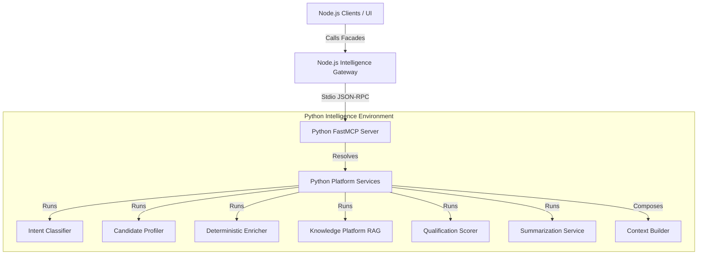

# System Overview

Meridian Revenue Copilot is a modular AI-powered recruitment pipeline copilot. It evaluates candidate resumes against job descriptions, normalization taxonomies, and recruiter search requirements.

---

## 1. High-Level Architecture

The platform uses a split-process architecture consisting of a Node.js API Gateway coordinating with a Python-based intelligence MCP server.

---

## 2. Core Layers

### A. Node.js Gateway Facade
- Exposes clean ES module clients (e.g. `intelligenceGateway.js`, `summarizationClient.js`, `qualificationClient.js`).
- Manages stdio subprocess transport lifecycles with the Python MCP server.
- Builds contextual trace headers (event IDs, session IDs, trace IDs) for tracking.

### B. Python MCP Server (`server.py`)
- Standardized FastMCP entrypoint supporting JSON-RPC commands.
- Wraps each intelligence tool with telemetry triggers and error boundaries.

### C. Python Domain Services
- **Intent Classifier**: Maps queries to actions.
- **Candidate Profiler**: Classifies role, seniority, and management taxonomies.
- **Deterministic Enricher**: Normalizes emails, phone formats, countries, timezones, and tech keywords.
- **Knowledge Platform**: Chunking, embeddings, vector database queries, and cosine ranking.
- **Qualification Scorer**: Scores candidate-JD alignment across multidimensional criteria.
- **Summarizer**: Converts score matrices and profiles into recruiter recommendations.
- **Context Builder**: Combines all outputs into an immutable ContextSnapshot.

### D. Shared Platform Core
- `config.py`: Environment loader with dotenv directory traversal.
- `telemetry.py`: Standardized execution tracking logs written to standard error stream.
- `contracts.py`: Standard Request/Response envelopes (`BaseRequest`, `BaseResponse`).

---

## 3. Project Phase Structure

- **Phase 1: Operational Automation**: Core MCP server framework, Intent Classifier, and basic profiling.
- **Phase 2: Intelligence Layer**: Vector DB RAG, enrichment normals, multidimensional scoring, and executive summarization.
- **Phase 3: State & Agentic Layer (In-Progress)**: Context snapshots, Memory service, conversation history tracking, and planners.
- **Phase 4: Production Integration**: Relational databases, production vector indexing, and recruiter interface integrations.
